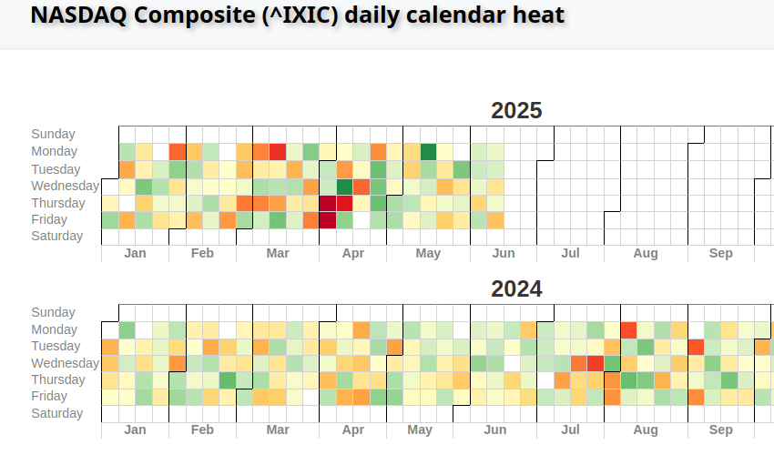

# tabheatcal - Heatmap visualization with easy value inspection


Heatmap calendar based solely on html + css table.
It allows you to easily add comments to event data.

<p align="center">

</p>
See working example:
<a href="https://htmlpreview.github.io/?https://github.com/ts-kontakt/tabheatcal/blob/master/SP500.html" target="_blank">Exmaple</a>

See the example below.

```python
from html import escape

import pandas as pd
import requests

# yahoo finance still down?
def get_prices():
    datetime.datetime.today().strftime("%Y-%m-%d")
    url = "https://fred.stlouisfed.org/graph/fredgraph.csv?bgcolor=%23ebf3fb&chart_type=line&drp=0&fo=open%20sans&graph_bgcolor=%23ffffff&height=450&mode=fred&recession_bars=on&txtcolor=%23444444&ts=12&tts=12&width=1320&nt=0&thu=0&trc=0&show_legend=yes&show_axis_titles=yes&show_tooltip=yes&id=SP500&scale=left&cosd=2020-06-12&coed=2025-06-12&line_color=%230073e6&link_values=false&line_style=solid&mark_type=none&mw=3&lw=3&ost=-99999&oet=99999&mma=0&fml=a&fq=Daily%2C%20Close&fam=avg&fgst=lin&fgsnd=2020-02-01&line_index=1&transformation=lin&vintage_date={today}&revision_date={today}&nd=2015-06-15"

    response = requests.get(url, headers={"User-agent": "Mozilla/5.0"}).text
    def parse_date(date_str): return datetime.datetime.strptime(date_str, "%Y-%m-%d")
    data = []
    for row in response.split("\n")[1:]:
        values = row.split(",")
        if len(values) == 2:
            date_str, price_str = values
            try:
                data.append([parse_date(date_str), float(price_str)])
            except ValueError:
                pass
    assert data
    return data

prices = get_prices()
df = pd.DataFrame(prices, columns=["date", "price"])
df["p_chng"] = df["price"].pct_change() * 100
all_days = pd.date_range(df.index.min(), df.index.max(), freq="D")
df.set_index("date", inplace=True)
all_days = pd.date_range(df.index.min(), df.index.max(), freq="D")
full_df = df.reindex(all_days)
selected = full_df["2021-01-01":"2025-12-31"]
print(selected)
dates = [pd.to_datetime(date) for date in selected.index.values]
values = selected.p_chng.values.tolist()
labels = ["%.2f%%" % val if not math.isnan(val) else "n/d" for val in selected.p_chng.values]

# Mark some important events
labels[dates.index(datetime.datetime(2025, 4, 3))] += "; <i>Tariffs announced!</i>"
labels[dates.index(datetime.datetime(
    2025, 4, 9))] += escape(';tweet: <i class="emph">"THIS IS A GREAT TIME TO BUY!!! DJT"</i>')

html = table_html(dates, values, labels)
create_page(html, title=f"SP500 daily calendar heat", output="SP500.html", startfile=True)
```
